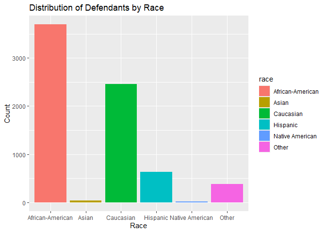

Lab 09: Algorithmic Bias
================
Hannah Crawley
4/9/2025

## Load Packages and Data

First, let’s load the necessary packages:

``` r
library(tidyverse)
library(fairness)
```

    ## Warning: package 'fairness' was built under R version 4.4.3

``` r
library(janitor)
```

    ## Warning: package 'janitor' was built under R version 4.4.3

### The data

For this lab, we’ll use the COMPAS dataset compiled by ProPublica. The
data has been preprocessed and cleaned for you. You’ll have to load it
yourself. The dataset is available in the `data` folder, but I’ve
changed the file name from `compas-scores-two-years.csv` to
`compas-scores-2-years.csv`. I’ve done this help you practice debugging
code when you encounter an error.

``` r
compas <- read.csv("data/compas-scores-2-years.csv")
```

# Part 1: Exploring the Data

## Exercise 1

> What are the dimensions of the COMPAS dataset? (Hint: Use inline R
> code and functions like nrow and ncol to compose your answer.) What
> does each row in the dataset represent? What are the variables?

``` r
ncol(compas)
```

    ## [1] 53

``` r
nrow(compas)
```

    ## [1] 7214

There are 53 columns (variables) and 7214 rows (offender observations)

## Exercise 2

> How many unique defendants are in the dataset? Is this the same as the
> number of rows? If not, why might there be a difference?

``` r
length(unique(compas$id))
```

    ## [1] 7214

There are 7214 unique defendants - suggesting that each offender
offended 1 time

## Exercise 3

> Let’s examine the distribution of the COMPAS risk scores
> (decile_score)! What do you observe about the shape of this
> distribution?

``` r
ggplot(compas, aes(x = decile_score)) +
  geom_histogram(binwidth = 1)
```

<!-- -->

The shape of the distribution is right skewed

## Exercise 4

> Let’s examine the demographic distribution in our dataset. Create
> visualizations to show: The distribution of defendants by race The
> distribution of defendants by sex The distribution of defendants by
> age category

``` r
ggplot(compas, aes(x = race, fill = race)) + 
  geom_bar()+
  labs(
    x = "Race",
    y = "Count",
    title = "Distribution of Defendants by Race")
```

<!-- -->

``` r
ggplot(compas, aes(x = sex, fill = sex)) + 
  geom_bar()+
  labs(
    x = "Sex",
    y = "Count",
    title = "Distribution of Defendants by Sex")
```

<!-- -->

``` r
ggplot(compas, aes(x = age_cat, fill = age_cat)) + 
  geom_bar()+
  labs(
    x = "Age Category",
    y = "Count",
    title = "Distribution of Defendants by Age Category")
```

<!-- -->

> For an extra challenge, try to create a single visualization that
> shows all three distributions side by side. You can use facets or
> color to differentiate between the different demographic groups.

``` r
compas_long <- compas %>%
  pivot_longer(cols = c(race, sex, age_cat),
               names_to = "Variable",
               values_to = "Category")
```

``` r
ggplot(compas_long, aes(x = Category, fill = Category)) +
  geom_bar(show.legend = FALSE) +
  facet_wrap(~ Variable, scales = "free_x") +
  labs(
    x = NULL,
    y = "Count",
    title = "Distribution of Defendants by Race, Sex, and Age Category"
  ) +
  theme_minimal() +
  theme(
    axis.text.x = element_text(angle = 45, hjust = 1),
    plot.title = element_text(hjust = 0.5)
  )
```

<!-- -->

# Part 2: Risk Scores and Recidivism

## Exercise 5

> Create a visualization showing the relationship between risk scores
> (decile_score) and actual recidivism (two_year_recid). Do higher risk
> scores actually correspond to higher rates of recidivism?

``` r
ggplot(compas, aes(x = decile_score , y = two_year_recid)) +
  geom_point(position = position_jitter (height =.05), alpha = .3) +
  geom_smooth(method = "lm", se = FALSE) +
  labs(title = "Relationship Between Risk Scores and Actual Recidivism")
```

    ## `geom_smooth()` using formula = 'y ~ x'

<!-- -->

``` r
compas %>%
  group_by(decile_score) %>%
  summarise(mean_recid = mean(two_year_recid)) %>%
  ggplot(aes(x = decile_score, y = mean_recid)) +
  geom_col(fill = "grey") +
  labs(
    title = "Average Recidivism Rate by Risk Score",
    x = "Risk Score (Decile)",
    y = "Proportion Recidivated"
  ) +
  theme_minimal()
```

<!-- -->

Higher risk scores appear to correspond with higher rates of recidivism.

## Exercise 6

> Calculate the overall accuracy of the COMPAS algorithm. For this
> exercise, consider a prediction “correct” if: A defendant with a high
> risk score (decile_score \>= 7) did recidivate (two_year_recid = 1) A
> defendant with a low risk score (decile_score \<= 4) did not
> recidivate (two_year_recid = 0)

``` r
compas <- compas %>%
  mutate(highrisk = ifelse(decile_score >= 7 & two_year_recid == 1, 1, 0))
```

``` r
compas <- compas %>%
  mutate(lowrisk = ifelse(decile_score <= 4 & two_year_recid == 0, 1, 0))
```

## Exercise 7

> How well does the COMPAS algorithm perform overall? What percentage of
> its predictions are correct based on your calculation above?

``` r
compas <- compas %>%
  mutate(correct_pred = ifelse(highrisk == 1 | lowrisk == 1, 1, 0))
```

``` r
accuracy <- mean(compas$correct_pred) * 100
paste0("Overall accuracy: ", round(accuracy, 2), "%")
```

    ## [1] "Overall accuracy: 55.89%"

``` r
compas %>%
  count(correct_pred) %>%
  mutate(percent = round(100 * n / sum(n), 2))
```

    ##   correct_pred    n percent
    ## 1            0 3182   44.11
    ## 2            1 4032   55.89

The Compas algorithm is roughly 56% accurate… I would hope for better
accuracy when determining life altering things such as incarceration …

# Part 3: Investigating disparities

Now let’s assess the predictive accuracy of the COMPAS algorithm across
different demographic groups. For this exercise, we’ll focus on race,
but you can also explore other demographic variable

## Exercise 8

> Create visualizations comparing the distribution of risk scores
> (decile_score) between Black and white defendants. Do you observe any
> differences?

``` r
compas %>%
  filter(race %in% c("Caucasian", "African-American")) %>%
  ggplot(aes(x = decile_score, fill = race)) +
  geom_bar()+
  labs(
    title = "Distribution of Risk Scores by Race",
    x = "Risk Score (Decile)",
    y = "Count"
  ) 
```

<!-- -->

## Exercise 9

> Calculate the percentage of Black defendants and white defendants who
> were classified as high risk (decile_score \>= 7). Is there a
> disparity?

``` r
compas %>%
  filter(race %in% c("Caucasian", "African-American")) %>%
  mutate(highrisk_ = ifelse(decile_score >= 7, 1, 0)) %>%
  group_by(race) %>%
  summarise(
    total = n(),
    highrisk = sum(highrisk_),
    proportionHR = round(mean(highrisk_), 2)
  )
```

    ## # A tibble: 2 × 4
    ##   race             total highrisk proportionHR
    ##   <chr>            <int>    <dbl>        <dbl>
    ## 1 African-American  3696     1425         0.39
    ## 2 Caucasian         2454      419         0.17

39% of African-Americans are classified as high risk whereas only 17% of
Caucasians are classified as high risk.

## Exercise 10

> Now, let’s look at the accuracy of predictions for different racial
> groups. Calculate the following metrics separately for Black
> defendants and white defendants: False Positive Rate: Proportion of
> non-recidivists (two_year_recid = 0) who were classified as high risk
> (decile_score \>= 7) False Negative Rate: Proportion of recidivists
> (two_year_recid = 1) who were classified as low risk (decile_score \<=
> 4)

``` r
compas %>% 
   filter(race %in% c("Caucasian", "African-American")) %>%
  group_by(race) %>%  
  summarise(
    FP = sum(decile_score >= 7 & two_year_recid == 0) / sum(two_year_recid == 0)
  )
```

    ## # A tibble: 2 × 2
    ##   race                 FP
    ##   <chr>             <dbl>
    ## 1 African-American 0.249 
    ## 2 Caucasian        0.0914

The false-positive rate for African-Americans is much higher (25%)
compared to Caucasians (9%) - suggesting a greater number of
African-Americans did not recidivate even though they were classified as
high risk

``` r
compas %>% 
   filter(race %in% c("Caucasian", "African-American")) %>%
  group_by(race) %>%  
  summarise(
    FN = sum(decile_score <= 4 & two_year_recid ==1)/ sum(two_year_recid == 1)) 
```

    ## # A tibble: 2 × 2
    ##   race                FN
    ##   <chr>            <dbl>
    ## 1 African-American 0.280
    ## 2 Caucasian        0.477

The false-negative rate for African-Americans is lower (28%) compared to
Caucasians (48%) - suggesting a greater number of Caucasians did
recidivate, but were classified as low risk

## Exercise 11

> Create a visualization comparing these metrics between Black and white
> defendants. What disparities do you observe?

``` r
error_rates <- compas %>%
  filter(race %in% c("African-American", "Caucasian")) %>%
  group_by(race) %>%
  summarise(
    FP = sum(decile_score >= 7 & two_year_recid == 0) / sum(two_year_recid == 0),
    FN = sum(decile_score <= 4 & two_year_recid == 1) / sum(two_year_recid == 1)
  )
```

``` r
error_rates_long <- error_rates %>%
  pivot_longer(cols = c(FP, FN), names_to = "ErrorType", values_to = "Rate")
```

``` r
ggplot(error_rates_long, aes(x = race, y = Rate, fill = ErrorType)) +
  geom_col(position = "dodge") +
  scale_y_continuous(labels = scales::percent) +
  labs(
    title = "False Positive and False Negative Rates by Race",
    x = "Race",
    y = "Rate",
    fill = "Error Type"
  )
```

<!-- -->

# Part 4: Understanding the source of bias

Note that their are many ways to measure bias in an algorithm. In this
exercise, we’ll focus on disparities in the false positive and false
negative rates. You can also explore other measures of bias, including
in the stretch goals.

## Exercise 12

> Let’s investigate what factors might be contributing to the
> disparities we’ve observed. Create a visualization showing the
> relationship between prior convictions (priors_count) and risk score
> (decile_score), colored by race. Does the algorithm weigh prior
> convictions differently for different racial groups?

``` r
compas %>%
  filter(race %in% c("Caucasian", "African-American")) %>%
  ggplot(aes(x = decile_score, fill = race)) +
  geom_bar(position = "dodge") +
  labs(
    title = "Distribution of Risk Scores by Race",
    x = "Risk Score (Decile)",
    y = "Number of Defendants"
  ) 
```

<!-- --> Yes - there
appears to be a significant drop in the number of defendants as risk
scores increase for Caucasian individuals but a steady trend for
African-Americans. More Caucasian defendants are labeled as low risk
while black defendants are more likely med or high risk.

## Exercise 13

> In 2016, ProPublica and Northpointe (the company that created COMPAS)
> had a disagreement about how to measure fairness. ProPublica focused
> on error rates (false positives and false negatives), while
> Northpointe focused on calibration (whether the same score means the
> same probability of recidivism across groups). Based on your analysis,
> do you see evidence supporting ProPublica’s claim that the algorithm
> is biased? Explain your reasoning.

I think both ProPublica and Northpoint are correct - there are
differences in error rates as well as whether probabilites are the same
across group. Both of these measures of fairness lead to the same
concern.

# Part 5: Designing fairer algorithms

## Exercise 14

> If you were tasked with creating a fairer risk assessment algorithm,
> what changes would you make to address the disparities you’ve
> observed?

I would go back to the start and look at what type of data was being fed
into the algorithm and retrain it based on data that was more accurate

## Exercise 15

> Different definitions of fairness can sometimes be mathematically
> incompatible with each other. What trade-offs might be involved in
> designing a “fair” algorithm for criminal risk assessment?

The fairness measures used here are not necessarily incompatible with
each other, rather they are looking at different things. I think it is
important to have a variety of measures. However, there are larger
moral, policy, legal and political implications.

## Exercise 16

> Beyond technical solutions, what policy changes might be needed to
> ensure that algorithmic risk assessments are used fairly in the
> criminal justice system?

I think a big policy change should be made regarding the transparency
and disclosure of how risk-assessment models developed - specifically,
how are trained and what data they are trained on.
